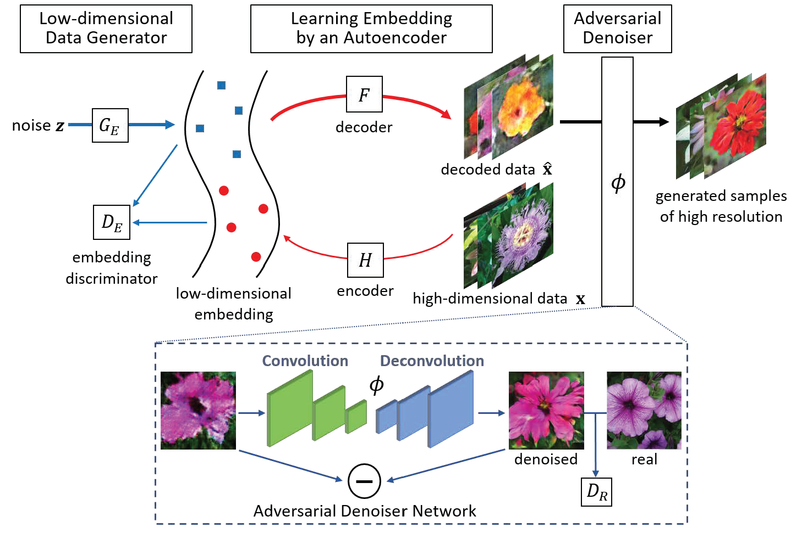
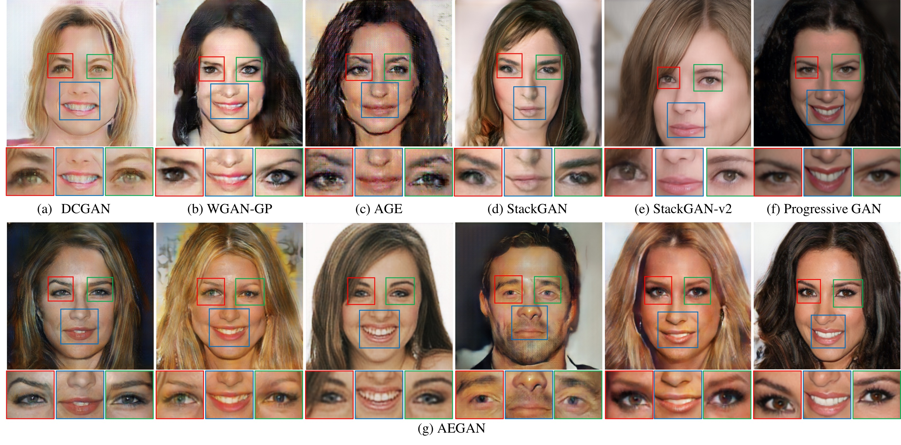
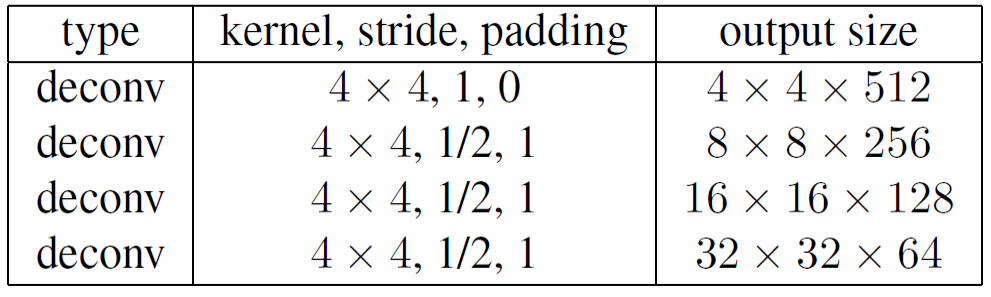
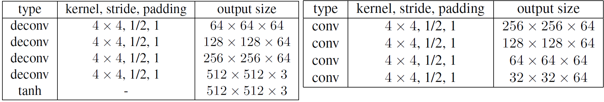

## AEGAN

Pytorch implementation for “Auto-Embedding Generative Adversarial Networks for High Resolution Image Synthesis”




## Dependencies
Python 2.7

Pytorch

## Dataset
In our paper, to sample different images, we train our model on five datasets, respectively.

- Download [Oxford-102 Flowers](http://www.robots.ox.ac.uk/~vgg/data/flowers/102/)  dataset.

- Download [Caltech-UCSD Birds (CUB) ](http://www.vision.caltech.edu/visipedia/CUB-200-2011.html) dataset.

- Download [Large-scale CelebFaces Attributes (CelebA)](http://mmlab.ie.cuhk.edu.hk/projects/CelebA.html)  dataset.

- Download [ Large-scale Scene Understanding (LSUN) ](http://lsun.cs.princeton.edu/2016/)  dataset.

- Download [ Imagenet ](http://www.image-net.org/)  dataset.

## Training
- Train AEGAN on Oxford-102 Flowers dataset.
```
python train.py --dataset flowers --dataroot your_images_folder --batchSize 16 --imageSize 512 --niter_stage1 100 --niter_stage2 1000 --cuda --outf your_images_output_folder --gpu 3
```
- If you want to train the model on Caltech-UCSD Birds (CUB), Large-scale CelebFaces Attributes (CelebA), Large-scale Scene Understanding (LSUN) or your own dataset. Just replace the hyperparameter like these:
```
python train.py --dataset name_of_dataset --dataroot path_of_dataset
```

<!--
## Evaluation Metrics

- Calculate the Inception Score
```
python get_score.py --dataset flowers --dataroot folder_of_generated_images --log_name log --imageSize 512
```
- Calculate the MS-SSIM
```
pythono msssim.py --data_path=folder_of_generated_images --log_name=log
```
- Calculate the Fréchet Inception Distance (FID)
```
python fid.py dir_1 dir_2 -i inception-2015-12-05/ --gpu 0
```
-->

<!--
## Examples generated by AEGAN


-->

## The details of the model

To synthesize embedding of 32x32x64, we use a generator G<sub>E</sub> (left) and a discriminator D<sub>E</sub> (right) with four convoluion layers, respectively.



The structure of the auto-encoder model contains a encoder H (righ) and  a decoder F (left).



The sturcture of denoiser network includes a encoder-decoder network (left) and a discriminator D<sub>R</sub> (right).


## Citation

If you use any part of this code in your research, please cite our paper:

```
@article{guo2019auto,
  title={Auto-Embedding Generative Adversarial Networks for High Resolution Image Synthesis},
  author={Guo, Yong and Chen, Qi and Chen, Jian and Wu, Qingyao and Shi, Qinfeng and Tan, Mingkui},
  journal={IEEE Transactions on Multimedia},
  year={2019},
  publisher={IEEE}
}
```

