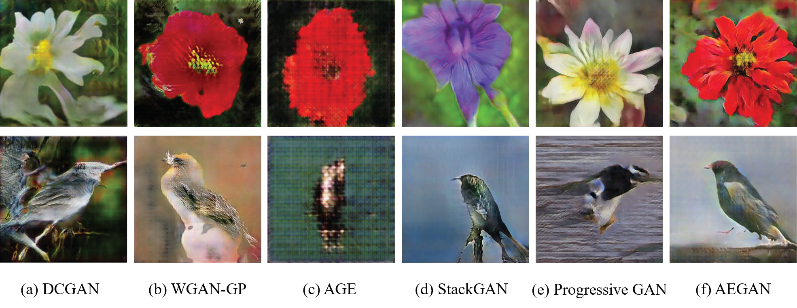

## AEGAN

Pytorch implementation for producing AEGAN results in the paper “Auto-Embedding Generative Adversarial Networks for High Resolution Image Synthesis”


## Dependencies
python 2.7

Pytorch

## Dataset
In our paper, to sample different images, we train our model on four datasets, respectively.

- Download [Oxford-102 Flowers](http://www.robots.ox.ac.uk/~vgg/data/flowers/102/)  dataset.

- Download [Caltech-UCSD Birds (CUB) ](http://www.vision.caltech.edu/visipedia/CUB-200-2011.html) dataset.

- Download [Large-scale CelebFaces Attributes (CelebA)](http://mmlab.ie.cuhk.edu.hk/projects/CelebA.html)  dataset.

- Download [ Large-scale Scene Understanding (LSUN) ](http://lsun.cs.princeton.edu/2016/)  dataset.

## Training
- Train AEGAN on Oxford-102 Flowers dataset.
```
python two-stage_train.py --dataset flowers --dataroot your_images_folder --batchSize 16 --imageSize 512 --niter_stage1 100 --niter_stage2 1000 --cuda --outf your_images_output_folder --gpu 3
```
- If you want to train the model on Caltech-UCSD Birds (CUB), Large-scale CelebFaces Attributes (CelebA), Large-scale Scene Understanding (LSUN) or your own dataset. Just replace the hyperparameter like these:
```
python two-stage_train.py --dataset name_o_dataset --dataroot path_of_dataset
```


## Evaluation Metrics

- Calculate the Inception Score
```
python get_score.py --dataset flowers --dataroot folder_of_generated_images --log_name log --imageSize 512
```
- Calculate the MS-SSIM
```
pythono msssim.py --data_path=folder_of_generated_images --log_name=log
```

## Examples generated by AEGAN


## Compared with baselines




